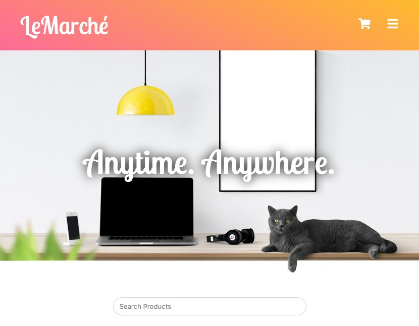

# LeMarche

[project's demo site](https://lemarche.megumi.no/)



## Brief

An interface for an fictional online shopping platform, utilizing data from a Noroff API.

## Built With

React, JS

## Getting Started

### Installing

1; Clone the repo:

```bash
git clone https://github.com/MegumiKim/lemarche.git
```

2; install dependencies

```bash
npm i
```

### Running

```bash
npm run dev
```

## Contact

Any issues / feedback, reach me on kimuramegumi@gmail.com
